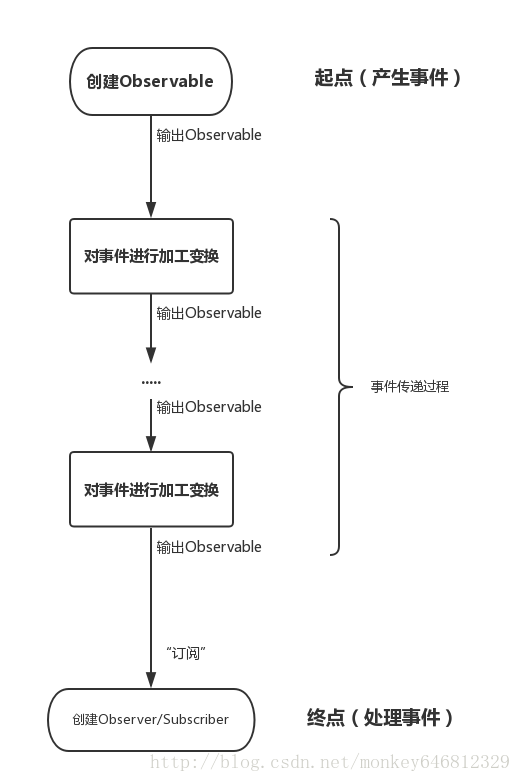
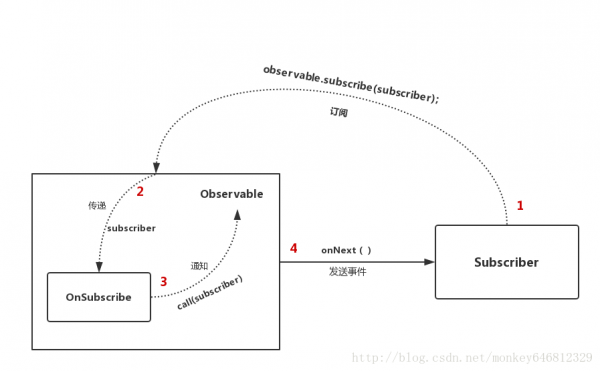

# reactive（rxjava)编程入门

## 响应式编程简介

### 什么是响应式编程

reactivex 项目的简述: Reactive Extensions for Async Programming (异步编程的响应式扩展)

rxjava 项目的简述:RxJava – Reactive Extensions for the JVM – a library for composing asynchronous and event-based programs using observable sequences for the Java VM.(一个在 Java VM 上使用可观测的序列来组成异步的、基于事件的程序的库)

那么现有的异步编程模式出现了什么问题？不好用？不好读？容易出错?对初学者不友好?

### RxJava 好在哪儿

换句话说，『同样是做异步，为什么人们用它，而不用现成的 ForkJoinPool,ScheduledExecutorService,ExecutorService,CountDownLatch,CyclicBarrier,Callable,FutureTask,各种队列？』

一个词：简洁。

异步操作很关键的一点是程序的简洁性，因为在调度过程比较复杂的情况下，异步代码经常会既难写也难被读懂。但是 rxjava 随着程序逻辑变得越来越复杂，它依然能够保持简洁。该处需要强调的是逻辑复杂度变得简洁而不是代码量减少.(逻辑变得简洁才能提升代码的读写速度)

线程池配置对初学者不友好,初学者滥用线程池,乱配置线程池参数.(ForkJoinPool,ScheduledExecutorService,ExecutorService,CountDownLatch,CyclicBarrier,Callable,FutureTask,各种队列,分别用来干什么的?)
线程池提交任务 Callable,Runnable 有什么却别?
线程池执行任务怎么保证可见性?怎么同步?

### 响应式编程的基础

观察者模式,Callback. 对于观察者模式则存在 Observable (被观察者) 和 Observer(观察者) 或者可以称之为 Subscriber (订阅者).对于回调我们则可以称之为 注册中心/事件中心/事件分发器 也就是被观察者, CallBack 则是接受被观察者的调用.(一旦谈到回调,不可避免的就无法回避 Callback hell 这个话题)

rxjava2 rxjava3:代理模式是源码实现

### 函数式编程


下面的 rxjava 代码均以 rxjava2 版本作为基础.虽然 rxjava2 将于 2021.02 停止维护.目前最新版本 rxjava3.[rxjava1 rxjava2 向 rxjava3 的迁移手册][https://github.com/ReactiveX/RxJava/wiki/What's-different-in-3.0] rxjava1 rxjava2 rxjava3 在同一个项目中是可以并存的,

## rxjava 实战

### 解决 Callback hell

### 缓存/过滤/去重/分组

### 同步两个异步请求/并发计算同步回调

### 实现通用的事件中心

### 采样数据

### 定时任务

### 多播/单播/重播

## reactive-streams 规范接口

### Publisher

### Subscriber

### Processor

### Subscription

## rxjava 基础组件简介

### Observable/创建

```java
        Observable.create(
                new ObservableOnSubscribe<String>() {
                    @Override
                    public void subscribe(ObservableEmitter<String> emitter) throws Exception {
                        ObservableEmitter<String> serialize = emitter.serialize();
                        serialize.onNext("one");
                        serialize.onNext("two");
                        serialize.onNext("three");
                        serialize.onComplete();
                    }
                })
```

```java
        Observable.just("one")
                  .subscribe(new Consumer<String>() {
                      @Override
                      public void accept(String s) throws Exception {
                          System.out.println("Accetp Data From ObservableEmitter:" + s);
                      }
                  })
```

### Subscriber/Observer

均为含有订阅者/观察者的语义.

rxjava1 的 Subscriber 继承了 Subscription 因此还含有订阅关系的语义表示.

在 rxjava2 rxjava3 则保持相同的设计 Observer 只含有订阅者/观察者的语义.订阅关系的语义则由 Disposable 单独表述.移除了Subscriber 这个类 *为什移除?* .但是也新增了 DisposableObserver 这个类,用于表示 rxjava1 中的 Subscriber 语义.

选择 Observer 和 Subscriber 是完全一样的。它们的区别对于使用者来说主要有两点：

- onStart(): 这是 Subscriber 增加的方法。它会在 subscribe 刚开始，而事件还未发送之前被调用，可以用于做一些准备工作，例如数据的清零或重置。这是一个可选方法，默认情况下它的实现为空。需要注意的是，如果对准备工作的线程有要求onStart() 就不适用了，因为它总是在 subscribe 所发生的线程被调用，而不能指定线程。

- unsubscribe(): 这是 Subscriber 所实现的另一个接口 Subscription 的方法，用于取消订阅。在这个方法被调用后，Subscriber 将不再接收事件。一般在这个方法调用前，可以使用 isUnsubscribed() 先判断一下状态。 unsubscribe() 这个方法很重要，因为在 subscribe() 之后， Observable 会持有 Subscriber 的引用，这个引用如果不能及时被释放，将有内存泄露的风险。所以最好保持一个原则：要在不再使用的时候尽快在合适的地方调用 unsubscribe() 来解除引用关系，以避免内存泄露的发生。

在 rxjava2 rxjava3 中则对应于 Disposable#dispose 和 Disposable#isDisposed 两个方法.

与传统观察者模式不同， RxJava 的事件回调方法除了普通事件 onNext()之外，还定义了两个特殊的事件：onCompleted() 和 onError()。

- onCompleted(): 事件队列完结。RxJava 不仅把每个事件单独处理，还会把它们看做一个队列。RxJava 规定，当不会再有新的 onNext() 发出时，需要触发 onCompleted() 方法作为标志。
  
- onError(): 事件队列异常。在事件处理过程中出异常时，onError() 会被触发，同时队列自动终止，不允许再有事件发出。
  
在一个正确运行的事件序列中, onCompleted() 和 onError() 有且只有一个，并且是事件序列中的最后一个。需要注意的是，onCompleted() 和 onError() 二者也是互斥的，即在队列中调用了其中一个，就不应该再调用另一个。

```java
        Observable.create(
                new ObservableOnSubscribe<String>() {
                    @Override
                    public void subscribe(ObservableEmitter<String> emitter) throws Exception {
                        ObservableEmitter<String> serialize = emitter.serialize();
                        serialize.onNext("one");
                        serialize.onNext("two");
                        serialize.onNext("three");
                        serialize.onComplete();
                    }
                })
                  .subscribe(new Consumer<String>() {
                      @Override
                      public void accept(String s) throws Exception {
                          System.out.println("Accetp Data From ObservableEmitter:" + s);
                      }
                  });
```

OUTPUT:

Accetp Data From ObservableEmitter:one

Accetp Data From ObservableEmitter:two

Accetp Data From ObservableEmitter:three




### Subscription/Disposable

### Scheduler

### Flowable

rxjava1 中不存在

### Single

### Maybe

rxjava1 中不存在.

### Completable

### Subject

## 高级概念

### 背压

生产者的生产效率大于消费者的消费效率.因此需要配置仓库容纳生产者生产的产品,或者直接按照配置的规则丢弃生产者生产的产品,再或者要求生产者放慢生产效率,按照需求生产产品.如果一直存储则会最终打爆内存导致崩溃.

rxjava1:在创建安全 Observable 时则要求传入背压策略进行背压控制.

rxjava2:Observable 不再支持背压控制策略语义,创建安全 Observable 时使用串行发射器默认的背压策略时无限缓存.只有创建 Flowable 时才会要求和可以进行背压策略控制.rxjava1 中不存在 Flowable 的概念.
*如果不需要串行化调用 onNext 方法,则不存在背压的问题*

### 串行访问

Observer#onNext 的串行化访问

rxjava1:

创建自定义的Observable分为两种:Observable#unsafeCreate和Observable#create,前者是不保证串行访问的,后者则会保证串行访问.同时前者也不保证 onError 和 onCompleted 只能被调用一次,当 onError 和 onComplete 被调用之后不能再调用 onNext 的语义规则.

rxjava2,rxjava3:

Observable#unsafeCreate,Observable#create,rxjava1,rxjava2 采用相同的实现和对外接口,Observable#create 重载的方法相比 rxjava1 精简到只有一个,对于背压的控制更加简单.

但是 Observable#create 创建的 Observable 不再保证串行化访问.如果需要串行化访问则需要使用 ObservableEmitter#serialize 获得串行化发射器,使用串行化发射器才能保证下游数据的串行访问.

队列漏和发射循环是实现串行化访问语义的基础算法.

### 冷/热 Observable

### Operator/Observable#lift

rxjava1 遗留的概念,在 rxjava1 中很多内置操作符语义都是通过 Operator 和 Observable#lift 进行实现的.

rxjava2 和 rxjava3 中则不再使用 Operator 实现内置的操作符语义.转而使用包装 Observable 和 Observer 实现操作符语义.提供给用户使用 Observable#as 操作符进行 Observable 的包装.

### Producer

rxjava1 遗留的概念,用于消费者协调生产者的生产效率,解决背压问题. rxjava2 中只有 Flowable 流中存在对应的概念.但是已经不是像 rxjava1 中使用自己定义的 Producer 而是使用 org.reactivestreams 规范中定义的 Subscription 接口.

### RxJavaHook 机制

### 响应式编程的定义/实现

[社区界的接口定义/规范定义][https://github.com/reactive-streams/]

[规范官网][https://www.reactive-streams.org/]

[主流的各种语言的实现][https://github.com/ReactiveX] 其中 rxjava 43.6k 个 star.rxjs 23.2k 个 star.

[Spring 也支持响应试编程][https://spring.io/reactive] 只不过其推荐了[另外一种实现方式][https://github.com/reactor/]作为其生态的一部分。

[jdk 9 增加了 flow 响应式编程的支持][https://docs.oracle.com/javase/9/docs/api/java/util/concurrent/Flow.Publisher.html]

### 谁在使用

[reactivex 官网下滑][http://reactivex.io/]

### Reference

[扔物线的 rxjava 入门教程][https://gank.io/post/560e15be2dca930e00da1083]

[rxjava1 源码分析][https://blog.piasy.com/AdvancedRxJava/index.html]

[串行访问,非阻塞算法 (emitter-loop)发射循环][https://blog.piasy.com/AdvancedRxJava/2016/05/06/operator-concurrency-primitives/index.html]

[串行访问,非阻塞算法 (queue-drain)队列漏] [https://blog.piasy.com/AdvancedRxJava/2016/05/13/operator-concurrency-primitives-2/index.html]