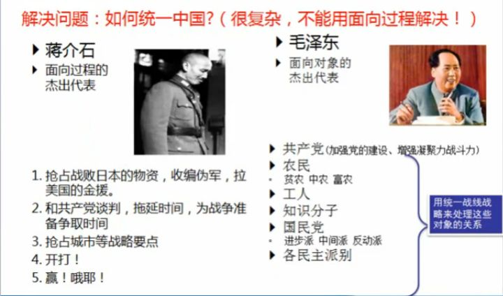
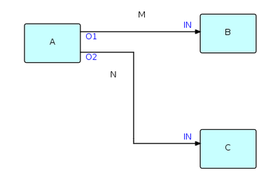

# 编程范式(Programming Paradigm)

现在很多的文章和演讲都在谈架构，很少有人再会谈及编程范式。

但是这些基础性和本质性的话题，却是非常非常重要的。在一些语言争论上，很多人对编程语言的认识其实并不深；另一方面，通过编程语言的范式，我们不但可以知道整个编程语言的发展史，而且还能提高自己的编程技能，进而写出更好的代码。

写代码需要遵循一定的原则，就像水流湍急的时候你需要天文罗盘来指引一样。

现在已经有一些通用的编程原则了，各种缩写词带领我们在编程的黑暗隧道里前行：DRY（不要重复自己，don't repeat yourself），高内聚低耦合（loose coupling high cohesion），YAGNI （你不会用到它的(最少依赖原则)，You Ain’t Gonna Need It）,LOD (Law of Demeter 最少知道原则)，最小意外原则（Principle of least surprise,遵循惯例,不要给别人带来意外），单一责任（single responsibility）,KISS（ Keep It Simple, Stupid,避免不必要的复杂度,引入提升复杂度之前考虑是否真的必要）原则等等。

## 常用的编程范式

编程范式:是一类典型的编程风格，是指从事软件工程的一类典型的风格.

托马斯.库恩提出“科学的革命”的范式论之后，Robert Floyd在1979年图灵奖的颁奖演说中使用了编程范式一词。编程范式一般包括三个方面，以OOP为例：

- 学科的逻辑体系——规则范式：如类/对象、继承、动态绑定、方法改写、对象替换等等机制。

- 心理认知因素——心理范式：按照面向对象编程之父Alan Kay的观点，“计算就是模拟”。OO范式极其重视隐喻（metaphor）的价值，通过拟人化，按照自然的方式模拟自然。

- 自然观/世界观——观念范式：强调程序的组织技术，视程序为松散耦合的对象/类的集合，以继承机制将类组织成一个层次结构，把程序运行视为相互服务的对象们之间的对话。

简单的说，编程范式是程序员看待程序应该具有的观点。

编程范式是编程语言的一种分类方式，它并不针对某种编程语言。就编程语言而言，一种语言可以适用多种编程范式。

一些编程语言是专门为某种特定范式设计的，例如C语言是过程式编程语言；Smalltalk和Java是较纯粹的面向对象编程语言；Haskell是纯粹的函数式编程语言。另外一些编程语言和编程范式的关系并不一一对应，如Python，Scala，Groovy,Kotlin 都支持面向对象和一定程度上的函数式编程。C++是多范式编程语言成功的典范。C++支持和C语言一样的过程式编程范式，同时也支持面向对象编程范式，STL（Standard Template Library）使C++具有了泛型编程能力。支持多种范式可能是C++直到现在仍然具有强大的生命力的原因之一。

### 结构化编程/非结构化编程

- 非结构化程序设计:是历史上最早的能够创造图灵完备算法的程序设计模式。在它之后，历史上又出现了结构化（过程化）程序设计、面向对象程序设计。
非结构化程序设计被批评最严重的方面就是会产生很难读懂的代码（戏称面条式代码），在创建大型工程方面有时会被认为是很差的，不过，因为赋予程序设计者很大的自由，被人称赞为如同莫扎特在谱曲。
非结构化程序设计语言既有高阶语言，也有低阶语言。一些语言通常被印证为非结构化语言，包括JOSS、FOCAL、TELCOMP、汇编语言、MS-DOS批处理和早期版本的BASIC、Fortran、COBOL和MUMPS。

```basic
_add_a_and_b:
   push   %ebx
   mov    %eax, [%esp+8]
   mov    %ebx, [%esp+12]
   add    %eax, %ebx
   pop    %ebx
   ret  

_main:
   push   3
   push   2
   call   _add_a_and_b
   add    %esp, 8
   ret
```

```basic
 public static void main(java.lang.String[]);
    descriptor: ([Ljava/lang/String;)V
    flags: ACC_PUBLIC, ACC_STATIC
    Code:
      stack=3, locals=5, args_size=1
         0: iconst_4
         1: istore_1
         2: iconst_2
         3: istore_2
         4: iload_1
         5: iload_2
         6: iand
         7: istore_3
         8: getstatic     #2                  // Field java/lang/System.out:Ljava/io/PrintStream;
        11: new           #3                  // class java/lang/StringBuilder
        14: dup
        15: invokespecial #4                  // Method java/lang/StringBuilder."<init>":()V
        18: ldc           #5                  // String c:
        20: invokevirtual #6                  // Method java/lang/StringBuilder.append:(Ljava/lang/String;)Ljava/lang/StringBuilder;
        23: bipush        25
        25: invokestatic  #7                  // Method java/lang/Integer.toHexString:(I)Ljava/lang/String;
        28: invokevirtual #6                  // Method java/lang/StringBuilder.append:(Ljava/lang/String;)Ljava/lang/StringBuilder;
        31: invokevirtual #8                  // Method java/lang/StringBuilder.toString:()Ljava/lang/String;
        34: invokevirtual #9                  // Method java/io/PrintStream.println:(Ljava/lang/String;)V
        37: ldc           #10                 // float Infinityf
        39: fstore        4
        41: getstatic     #2                  // Field java/lang/System.out:Ljava/io/PrintStream;
        44: new           #3                  // class java/lang/StringBuilder
        47: dup
        48: invokespecial #4                  // Method java/lang/StringBuilder."<init>":()V
        51: ldc           #11                 // String Float Pos Infinite:
        53: invokevirtual #6                  // Method java/lang/StringBuilder.append:(Ljava/lang/String;)Ljava/lang/StringBuilder;
        56: fload         4
        58: invokevirtual #12                 // Method java/lang/StringBuilder.append:(F)Ljava/lang/StringBuilder;
        61: invokevirtual #8                  // Method java/lang/StringBuilder.toString:()Ljava/lang/String;
        64: invokevirtual #9                  // Method java/io/PrintStream.println:(Ljava/lang/String;)V
        67: return
```

一个使用非结构化语言的程序经常包含按顺序排列的命令或声明，通常每个都占用一行。每一行都有编号或者标签，这样程序中的任意行都可以被执行。

非结构化程序设计引入了基本控制流的概念，比如循环、分支和跳转。尽管在非结构化模式中不存在过程，不过子程序还是可以使用的。和过程不同，子程序可能有多个入口和出口。子程序中是允许直接跳转入或跳转出的。这种灵活性可以实现协同程序，而这在过程化程序设计中是相当困难以至于不可能的。

非结构化程序设计中是没有本地变量的概念的，不过标签和变量可以在有限的区域中起作用。这意味着在调用子程序时不需要上下文刷新，而所有的变量保持它们之前被调用后的值。这样，实现递归就很困难了(递归依赖于方法调用栈对局部变量,调用现场的保存)。而嵌套的深度被限制在1或2级。

- 结构化编程:它采用子程序、块结构、for循环以及while循环等结构，来取代传统的 goto。希望借此来改善计算机程序的明晰性、质量以及开发时间，并且避免写出面条式代码.用任何语言都可以进行结构化编程，不过一般较常使用过程式的编程语言。早期的结构化编程语言包括ALGOL、 Pascal、PL/I及Ada，不过后来大部分的过程式编程语言都鼓励使用结构化编程，有时也会特意的省去一些特性（例如不支持goto指令）使得非结构化的编程更加困难。*结构化编程不再支持随意跳转到任意指令位置(代码行数)进行执行操作,*

### 过程式编程

有时会被视为是指令式编程的同义语。派生自结构化编程（Structured programming），主要采取程序调用（procedure call）或函数调用（function call）的方式来进行流程控制。流程则由包涵一系列运算步骤的过程（Procedures），例程（routines），子程序（subroutines）, 方法（methods），或函数（functions）来控制。在程序运行的任何一个时间点，都可以调用某个特定的程序。任何一个特定的程序，也能被任意一个程序或是它自己本身调用.

### 命令式编程(指令式编程)

是一种描述电脑所需作出的行为的编程典范。几乎所有电脑的硬件工作都是指令式的；几乎所有电脑的硬件都是设计来运行机器代码，使用指令式的风格来写的。较高端的指令式编程语言使用变量和更复杂的语句，但仍依从相同的典范。菜谱和行动清单，虽非计算机程序，但与指令式编程有相似的风格：每步都是指令，有形的世界控制情况。因为指令式编程的基础观念，不但概念上比较熟悉，而且较容易具体表现于硬件，所以大部分的编程语言都是指令式的。

过程化编程(命令式编程)的步骤是：

首先，我们必须将待解问题的解决方案抽象为一系列概念化的步骤。然后通过编程的方式将这些步骤转化为程序指令集（算法），而这些指令按照一定的顺序排列，用来说明如何执行一个任务或解决一个问题。这就意味着，程序员必须要知道程序要完成什么，并且告诉计算机如何来进行所需的计算工作，包括每个细节操作。简言之，就是将计算机看作一个善始善终服从命令的装置。

所以在命令式编程中，把待解问题规范化、抽象为某种算法是解决问题的关键步骤。其次，才是编写具体算法和完成相应的算法实现问题的正确解决。当然，程序员对待解问题的抽象能力也是非常重要的因素，但这本身已经与编程语言无关了。

程序流程图是过程化语言进行程序编写的有效辅助手段.对应与类图则是面向对象编程

大部分的高级语言都支持四种基本的语句：

- 运算语句: 一般来说都表现了在存储器内的资料进行运算的行为，然后将结果存入存储器中以便日后使用。高端指令式编程语言更能处理复杂的表达式，可能会产生四则运算和函数计算的结合。

- 循环语句: 容许一些语句反复运行数次。循环可依据一个默认的数目来决定运行这些语句的次数；或反复运行它们，直至某些条件改变。

- 条件分支语句: 容许仅当某些条件成立时才运行某个区块。否则，这个区块中的语句会略去，然后按区块后的语句继续运行。
  
- 无条件分支语句: 容许运行顺序转移到程序的其他部分之中。包括跳跃（在很多语言中称为Goto）、副程序和Procedure等。

循环、条件分支和无条件分支都是控制流程。

命令式编程与声明式编程是对立的.在命令式编程中数据与处理是相互方法相互分开.同时任意方法可以很容易的得到可能并不应该它得到的数据并改写他.

在1980年后，面向对象编程有迅速的发展；面向对象编程语言均有着指令式的风格，但增添了支持对象的功能。

### 面向对象编程(OOP)

从编程的发展史来谈面向对象的出现。当软件还非常简单的时候，我们只需要面向过程编程：

定义函数

函数一 函数二 函数三 函数四

定义数据

数据一 数据二 数据三 数据四

最后各种函数，数据的操作。

当软件发展起来后，我们的软件变得越来越大，代码量越来越多，复杂度远超Hello World的时候，我们的编写就有麻烦了：函数和数据会定义得非常多，面临两个问题。首先是命名冲突，英文单词也就那么几个，可能写着写着取名时就没合适的短词用了，为了避免冲突，只能把函数名取得越来越长。然后是代码重复，我们可以用函数里面调用函数的方法，但是函数调函数（比如一个功能多个方法（函数），几个功能混用方法）不便于维护。

面向对象概念的程序编程典范，同时也是一种程序开发的抽象方针。它可能包含资料、属性、代码与方法。对象则指的是类的实例。它将对象作为程序的基本单元，将程序和数据封装其中，以提高软件的重用性、灵活性和扩展性，对象里的程序可以访问及经常修改对象相关连的资料。在面向对象程序编程里，计算机程序会被设计成彼此相关的对象.

面向对象程序设计可以看作一种在程序中包含各种独立而又互相调用的对象的思想，这与传统的思想刚好相反：传统的程序设计主张将程序看作一系列函数的集合，或者直接就是一系列对电脑下达的指令。面向对象程序设计中的每一个对象都应该能够接受数据、处理数据并将数据传达给其它对象，因此它们都可以被看作一个小型的“机器”，即对象。目前已经被证实的是，面向对象程序设计推广了程序的灵活性和可维护性，并且在大型项目设计中广为应用。此外，支持者声称面向对象程序设计要比以往的做法更加便于学习，因为它能够让人们更简单地设计并维护程序，使得程序更加便于分析、设计、理解。反对者在某些领域对此予以否认。

面向对象和面向过程的区别最直观的比喻就如：摇（狗尾巴）和 狗.摇尾巴（）的区别。

当我们提到面向对象的时候，它不仅指一种程序设计方法。它更多意义上是一种程序开发方式。在这一方面，我们必须了解更多关于面向对象系统分析和面向对象设计（Object Oriented Design，简称OOD）方面的知识。许多流行的编程语言是面向对象的,它们的风格就是会透由对象来创出实例。使用面向对象编程语言，易于构建软件模型。因为，对象很容易和现实世界上的所有事物和概念相类似。

重要的面向对象编程语言包含 Common Lisp、Python、C++、Objective-C、Smalltalk、Delphi、Java、Swift、C#、Perl、Ruby 与 PHP等。

对象模型的分类:

- 静态函数包对象
  
  将功能有联系的一批函数放在一起封装成一个类。这种类可以完全没有内部数据，也可以有数据。当有数据时，这些数据充当的其实就是配置（配置对于一个设计优秀的对象，是透明的，对象本身内部的函数根本不知道有配置这个东西，它只知道它需要的每一个数据在它new之后就已经存在this里了，随取随用。配置的给予或获取方式，是构建对象(new)时才需要去考虑的）这种对象的特点是，它的每一个函数(或方法)对这些数据都是只读的，所以不管方法有无被调用，被谁调用，被调用多少次，它也不会改变它的状态。

- 领域模型对象

这个概念是相对于传统的面向数据库的系统分析和设计而言的。数据库虽然只用了外键就描述了复杂的大千世界，但软件开发的难点在于适应变化，并且能够安全地修改。关系模型看似简单，但它却像一张蜘蛛网一样将所有table和栏位包在一块，牵一发而动全身，让你在修改时如履薄冰，一不小心就会顾此失彼，bug此起彼伏。而OO的封装特性则刚好可以用来解决这个问题。将业务数据整理成一个个独立的对象，让它们的数据只能被自己访问。留给外界的基本上只是一些接口（方法），数据除非万不得已，一个都不会公开。外界只能向它发送消息，它自己则通过修改自身数据来响应这种消息。这种对象与第一种对象刚好相反，它一定有数据，而且它的每一个函数存在的目的就是修改自己的数据。且每一次修改都是粗粒度的，每一次修改后，对象也还是处在可用状态。

- 临时对象

其它用来解决过程式开发时，超多的变量，超复杂的流程而整理出来的小对象。这些对象一起协作，最后完成一个传统成千上万行的过程式代码才能完成的功能。例如现在要连接sql server执行查询语句并取得结果返回。不使用任何类库和工具，所有步骤都自己进行，例如解析协议，socket网络连接，数据包收发等。这时候从头到尾用一个个函数来完成，绝对没有先划分出一个个职责分明的对象，让各对象协作完成这件事情来得更简单。

但编程实践表明，并不是任何东西成为对象都是一件好事情。举一个Java中的蹩足的例子：Java中只有对象才能作为参数传入函数（当然还有原始类型primitive type）。所以为了将函数传递给另外一个函数，你需要将函数包裹在一个对象中，通常会用一个匿名类，因为这个类不会有其他作用，只是为了让Java的一切皆为对象的设计高兴。

同时面向对象还会存在一个问题:它们永远都要随身携带那些隐式的环境。你只需要一个香蕉，但却得到一个拿着香蕉的大猩猩...以及整个丛林

面向对象的三个基本概念:封装,继承,多态.

面向对象的三个基本要素:类,接口,方法,属性.

- 类: 对象的定义
- 接口: 行为规范的定义
- 方法: 行为的定义
- 属性: 对象固有的内在的数据



### 面向切面编程(AOP)

Aspect-oriented programming 又译作面向方面的程序设计、剖面导向程序设计）是计算机科学中的一种程序设计思想，旨在将横切关注点与业务主体进行进一步分离，以提高程序代码的模块化程度。通过在现有代码基础上增加额外的通知（Advice）机制，能够对被声明为“切点（Pointcut）”的代码块进行统一管理与装饰，如“对所有方法名以‘set*’开头的方法添加后台日志”。该思想使得开发人员能够将与代码核心业务逻辑关系不那么密切的功能（如日志功能）添加至程序中，同时又不降低业务代码的可读性。面向切面的程序设计思想也是面向切面软件开发的基础。

面向切面的程序设计将代码逻辑切分为不同的模块（即关注点（Concern），一段特定的逻辑功能)。几乎所有的编程思想都涉及代码功能的分类，将各个关注点封装成独立的抽象模块（如函数、过程、模块、类以及方法等），后者又可供进一步实现、封装和重写。部分关注点“横切”程序代码中的数个模块，即在多个模块中都有出现，它们即被称作“横切关注点（Cross-cutting concerns, Horizontal concerns）”。

日志功能即是横切关注点的一个典型案例，因为日志功能往往横跨系统中的每个业务模块，即“横切”所有有日志需求的类及方法体。而对于一个信用卡应用程序来说，存款、取款、帐单管理是它的核心关注点，日志和持久化将成为横切整个对象结构的横切关注点。

切面的概念源于对面向对象的程序设计的改进，但并不只限于此，它还可以用来改进传统的函数。面向切面的编程模式主要还是在 java 中通过 AspectJ 得到了完整的支持.js 中 webpack/babel 工具或许也能实现面向切面的功能.

### 声明式编程

与命令式编程相对比。它描述目标的性质，让电脑明白目标，而非流程。声明式编程不用告诉电脑问题领域，从而避免随之而来的副作用。而命令式编程则需要用算法来明确的指出每一步该怎么做。
声明式编程通常被看做是形式逻辑的理论，把计算看做推导。声明式编程因大幅简化了并行计算的编写难度，自2009起备受关注。声明式语言包括数据库查询语言（SQL，XQuery），正则表达式，逻辑编程，函数式编程和组态管理系统。声明式编程透过函数、推论规则或项重写（term-rewriting）规则，来描述变量之间的关系。它的语言运行器（编译器或解释器）采用了一个固定的算法，以从这些关系产生结果。

前端中 react 框架的实现模式也是一种声明式的编程模式.

一些DSL(领域专用语言) 的设计,则是为了让使用者只需要使用声明式编程的方式,即可以实现自己关注的特定的领域问题的处理.处理的过程流程则隐藏在这些 DSL 语言的实现背后.如: gradle (解决应用程序构建的DSL).

问题并没有被实质简化,问题还是那个问题.只不过语言的实现者把复杂留给了自己,把简单留给了使用者.

### 函数式编程

它将电脑运算视为函数运算，并且避免使用程序状态以及易变对象。其中，λ演算（lambda calculus）为该语言最重要的基础。而且，λ演算的函数可以接受函数当作输入（引数）和输出（传出值）。比起指令式编程，函数式编程更加强调程序执行的结果而非执行的过程，倡导利用若干简单的执行单元让计算结果不断渐进，逐层推导复杂的运算，而不是设计一个复杂的执行过程。在函数式编程中，函数是第一类对象，意思是说一个函数，既可以作为其它函数的参数（输入值），也可以从函数中返回（输入值），被修改或者被分配给一个变量。

函数式编程最著名的例子是 Haskell.函数式编程关心类型（代数结构）之间的关系，命令式编程关心解决问题的步骤。

命令式编程是面向计算机硬件的抽象，有变量（对应着存储单元），赋值语句（获取，存储指令），表达式（内存引用和算术运算）和控制语句（跳转指令），一句话，命令式程序就是一个冯诺依曼机的指令序列。

而函数式编程是面向数学的抽象，将计算描述为一种表达式求值，一句话，函数式程序就是一个表达式。

函数式编程最重要的特点是“函数第一位”，即函数可以出现在任何地方，比如你可以把函数作为参数传递给另一个函数，不仅如此你还可以将函数作为返回值。

不可变对象实现:
JS: [immutable-js](https://github.com/immutable-js/immutable-js)
JAVA: [immutables](https://github.com/immutables/immutables)

Java:Stream,方法引用,函数接口
Kotlin:对集合做了函数式扩展,方法可以作为变量
JS: 内置了集合的函数式方法,通过 ramda,loadash 可以实现 compose,curry,memonize 功能.

## 其他的一些编程范式

### 基于原型编程

称为原型程序设计、原型编程，是面向对象编程的子系统和一种方式。在原型编程中，行为重用（在基于类的语言通常称为继承）是通过复制已经存在的原型对象的过程实现的。这个模型一般被认为是无类的、面向原型、或者是基于实例的编程。

原型编程最初的（也是最经典的）例子是编程语言Self，它是由David Ungar和Randall Smith开发的。但是无类编程方式最近变得越来越受欢迎，并且被JavaScript、Cecil、NewtonScript、Io、Ioke、MOO、REBOL，还有一些其他的程序语言所采纳。

### 事件驱动编程

Event-driven programming 是一种电脑程序设计模型。这种模型的程序运行流程是由用户的动作（如鼠标的按键，键盘的按键动作）或者是由其他程序的消息来决定的。相对于批处理程序设计（batch programming）而言，程序运行的流程是由程序员来决定。批处理（batch）的程序设计在初级程序设计教学课程上是一种方式。然而，事件驱动程序设计这种设计模型是在交互程序（Interactive program）的情况下孕育而生的。

事件驱动程序可以由任何编程语言来实现，然而使用某些语言来撰写会比其他的语言来的简单。有些集成开发环境（简称IDE）也会影响实现事件驱动程序设计的难易程度。有的 IDE 会使的开发工作变的很简单

- 事件: 就是通知某个特定的事情已经发生（事件发生具有随机性）
  
- 事件与轮询: 轮询的行为是不断地观察和判断，是一种无休止的行为方式。而事件是静静地等待事情的发生。事实上，在Windows出现之前，采用鼠标输入字符模式的PC应用程序必须进行串行轮询，并以这种方式来查询和响应不同的用户操做.
目前采用的策略一般都是基于事件循环队列的阻塞与唤醒操作,替代传统意义上的事件串行轮询操作.
  
- 事件处理器: 是对事件做出响应时所执行的一段程序代码。事件处理器使得程序能够对于用户的行为做出反映

### 基于流程编程

基于流程（flow-based）编程，缩写为FBP，是一种编程范式，它将应用定义为黑箱进程的网络，它们经过预先定义的连接，通过消息传递来交换数据，而这里的连接是在“外部”指定给进程的。这些黑箱进程不需要更改内部，就可以无尽的重新连接而形成不同的应用。FBP因而是天然基于构件的。

FBP是一种特殊形式的数据流程编程，它基于了有界缓冲区，带有确定生存时间的信息包，命名端口，和独立的连接的定义



### 响应式编程

响应式编程或反应式编程（英语：Reactive programming）是一种面向数据流和变化传播的声明式编程范式。这意味着可以在编程语言中很方便地表达静态或动态的数据流，而相关的计算模型会自动将变化的值通过数据流进行传播。

### 函数式响应式编程

函数式反应式编程(FRP) 是一种采用函数式编程的基础部件（如 map、reduce、filter 等）进行反应式编程（异步数据流程编程）的编程范式。FRP 被用于GUI、机器人和音乐方面的编程，旨在通过明确时间模型来简化这些问题。1997 年被提出.

### 泛型程序设计

泛型程序设计（generic programming）是程序设计语言的一种风格或范式。泛型允许程序员在强类型程序设计语言中编写代码时使用一些以后才指定的类型，在实例化时作为参数指明这些类型。各种程序设计语言和其编译器、运行环境对泛型的支持均不一样。Ada、Delphi、Eiffel、Java、C#、F#、Swift 和 Visual Basic .NET 称之为泛型（generics）；ML、Scala 和 Haskell 称之为参数多态（parametric polymorphism）；C++ 和 D称之为模板。具有广泛影响的1994年版的《Design Patterns》一书称之为参数化类型（parameterized type）。

泛型编程是一个稍微局部一些的概念，它仅仅涉及如何更抽象地处理类型，即参数化类型。这并不足以支撑起一门语言的核心概念。我们不会听到一个编程语言是纯泛型编程的，而没有其他编程范式。但正因为泛型并不会改变程序语言的核心，所以在大多数时候，它可以很好的融入到其他的编程方式中。C++，Scala，Haskell这些风格迥异的编程语言都支持泛型。泛型编程提供了更高的抽象层次，这意味着更强的表达能力。这对大部分编程语言来说都是一道美味佐餐美酒。

在Swift中，泛型得到广泛使用，许多Swift标准库是通过泛型代码构建出来的。例如Swift的数组和字典类型都是泛型集。这样的例子在Swift中随处可见。

## 基于不同的编程范式处理相同的问题的不同点

- 过滤列表中的奇数,得到全是奇数的列表

  指令式编程如何实现?函数式编程如何实现?

- 教务管理系统

  基于 C 如何实现?基于 C++,Java 如何实现?

- Web 中更新 UI
  
  指令式编程如何实现?声明式编程如何实现?

## 不同编程模式对比

- 结构化编程 VS 非结构化编程

- OOP VS 过程式编程

- 命令式编程 VS 声明式编程

- OOP VS FP

## 总结

Java拥有纯粹的面向对象概念。它从设计之初，就希望以一切皆为对象的纯对象模型来为世界建模。但发展到现在，Java中加入了越来越多非对象的东西。引入了闭包，lambda 表达式,函数式接口,从而获得了函数式编程中的一级函数；引入泛型，从而获得了参数化的类型。这可能暗示了，这个世界是如此得丰富多彩，使用单一模式为世界建模并不会成功。

JS 就更不用说了,函数是一等公民,同时也支持面向对象.

Swift是一门典型的多范式编程语言，即支持面向对象编程范式，也支持函数式编程范式，同时还支持泛型编程。Swift支持多种编程范式是由其创造目标决定的。Swift创造的初衷就是提供一门实用的工业语言。不同于Haskell这类出自大学和研究机构的学术性质的编程语言。苹果推出Swift时就带着着明确的商业目的：Mac OS和iOS系统的主要编程语言Objective-C已显老态，Swift将使得苹果系统的开发者拥有一门更现代的编程语言，从而促进苹果整个生态圈的良性发展。

## Refrences

- [编程范型](https://zh.wikipedia.org/wiki/%E7%BC%96%E7%A8%8B%E8%8C%83%E5%9E%8B)

- [再谈编程范式—程序语言背后的思想](https://imweb.io/topic/5cde5770e363b77a0edeb874#:~:text=%E9%9C%80%E8%A6%81%E6%8F%90%E9%86%92%E7%9A%84%E6%98%AF%EF%BC%9A%E7%BC%96%E7%A8%8B,%E7%9A%84%E5%87%BD%E6%95%B0%E5%BC%8F%E7%BC%96%E7%A8%8B%E8%AF%AD%E8%A8%80%E3%80%82)

- [编程范式游记](https://time.geekbang.org/column/article/107576)